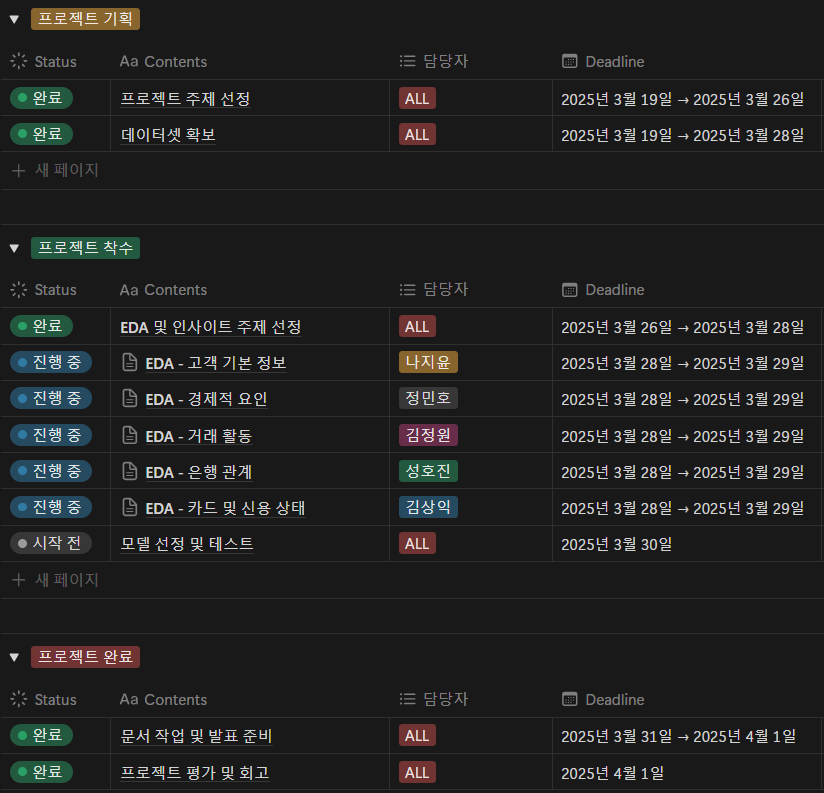

# 은행 고객 이탈 예측 프로젝트
 

## 목차
### 1. 팀 소개
### 2. 프로젝트 개요
### 3. EDA
### 4. 모델 선정 및 성능 평가
### 5. 결론
### 6. 한 줄 회고평
 

## 팀 소개

- **팀명**: 
<table>
  <thead>
    <td align="center">
      <a href="https://github.com/DawnSurplus">
         

        성호진
      </a> 
    </td>
    <td align="center">
      <a href="https://github.com/GTU9">
         

        김상익
      </a> 
    </td>
    <td align="center">
      <a href="https://github.com/Nadaeji">
         

        나지윤
      </a> 
    </td>
    <td align="center">
      <a href="https://github.com/Kimjeongwon12">
         

        김정원
      </a> 
    </td>
    <td align="center">
      <a href="https://github.com/Minor1862">
         

        정민호
      </a> 
    </td>
  </thead>
</table>

---
   

## 📌 프로젝트 개요 (정리 필요)
- 본 프로젝트는 머신러닝을 활용하여 은행/신용카드 가입 고객의 이탈을 예측하는 모델을 개발하는 것을 목표로 합니다.

### 배경
- 금융권에서는 고객 이탈을 방지하는 것이 매우 중요
- 고객 이탈 예측 모델을 활용하면, 이탈 가능성이 높은 고객을 사전에 식별하고 적절한 마케팅 전략을 수립 가능능

### 🎯 목표
- 고객 이탈 여부를 예측하는 머신러닝 모델을 구축
- 주요 영향을 미치는 요인을 분석하여 인사이트를 도출
- 예측 결과를 시각화하여 인사이트를 제공
  

### 🛠 기술 스택

| 🎯 분야 | 🚀 사용 기술 |
|------|------|
| 📝 언어 |  |
| 📊 데이터 분석 | ,  |
| 🎨 시각화 |   |
| 🔗 협업 |   |

---
  

### WBS

---
   

## 📊 EDA

**🔥 핵심 질문:**
- **고객 기본 정보에 따른 이탈 요인 분석**
- **경제적 요인에 따른 이탈 요인 분석**
- **거래 활동에 따른 이탈 요인 분석**
- **은행 관계에 따른 이탈 요인 분석**
- **카드 및 신용 상태에 따른 이탈 요인 분석**

**⚡️ 데이터 처리 과정:**
- 결측치 제거 🛠
- 이상치 탐지 🔍
- 범주형 데이터 인코딩 🔢

---
   

## 🤖 머신러닝 모델 & 성능 평가

### **🧠 실험할 모델:**
- 로지스틱 회귀
- 랜덤 포레스트
- XGBoost
- LightGBM
  

### **🎯 평가 지표:**
- **정확도 (Accuracy)**
- **정밀도 (Precision)**
- **재현율 (Recall)**
- **F1-score**
- **ROC-AUC Curve**

---
   

## 🚀 프로젝트 결과

✅ **최적 모델의 성능:** XX% 정확도  
✅ **가장 중요한 피처:** XX (예: 월평균 거래량, 고객 충성도 등)  
✅ **비즈니스 인사이트:** "XX 고객은 특정 요인으로 인해 이탈 가능성이 높음"

---
   

## 🎭 한 줄 회고평

> 성호진 - (후딱 끝내자자)

> 김상익

> 나지윤

> 김정원

> 정민호
